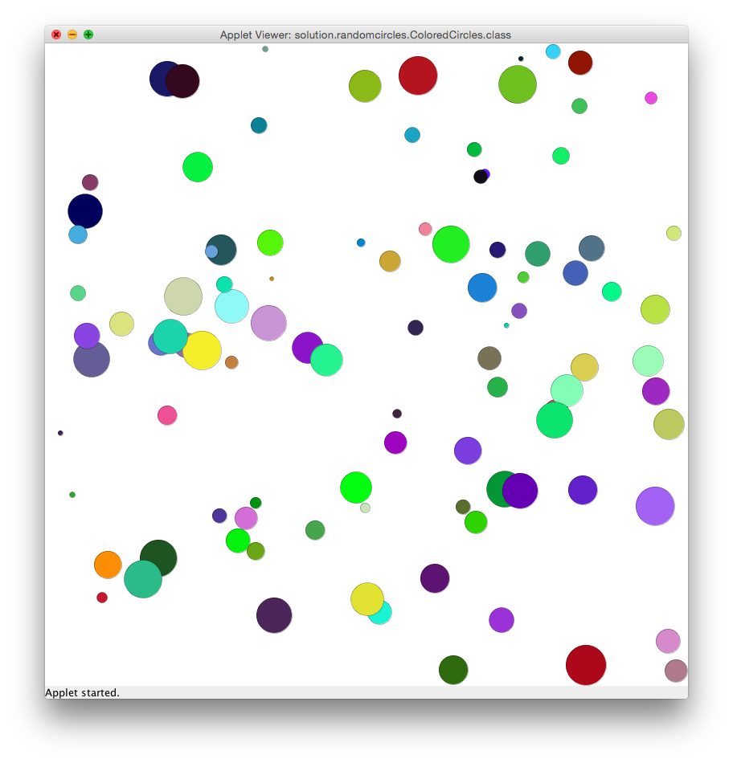

# U12 | Farbige Zufallskreise

Entwickeln Sie eine `GraphicsApp`, die 100 farbige Kreise auf der
Zeichenfläche darstellt. Jeder der Kreise hat eine zufällige Farbe,
einen zufälligen Durchmesser zwischen 5 und 50 Pixeln und eine zufällige
Position auf der Zeichenfläche. Die Kreise müssen alle innerhalb der
Zeichenfläche dargestellt werden. Verwenden Sie die in der Vorlesung
vorgestellte Klasse `Random` um alle Zufallswerte zu erzeugen.

| So sollen die Zufallskreise aussehen |
|:----:|
|  |

Implementieren Sie eine eigene Methode pro zufälliger Eigenschaft der
Kreise und speichern Sie den Rückgabewert in einer lokalen Variable,
bevor Sie den Konstruktor der Klasse Ellipse aufrufen:

-   `private Color getNextColor()`

-   `private Point getNextPoint()`

-   `private int getNextDiameter()`

Verwenden Sie (wie immer) geeignete Konstanten, um unveränderliche Werte abzuspeichern.
